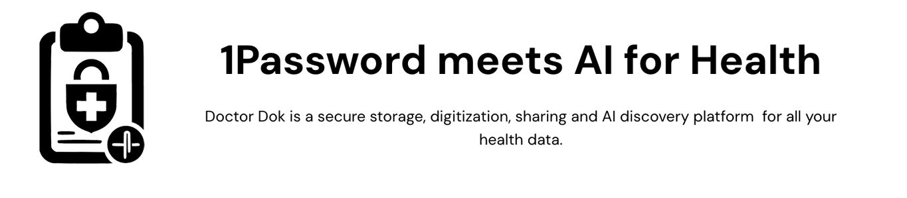
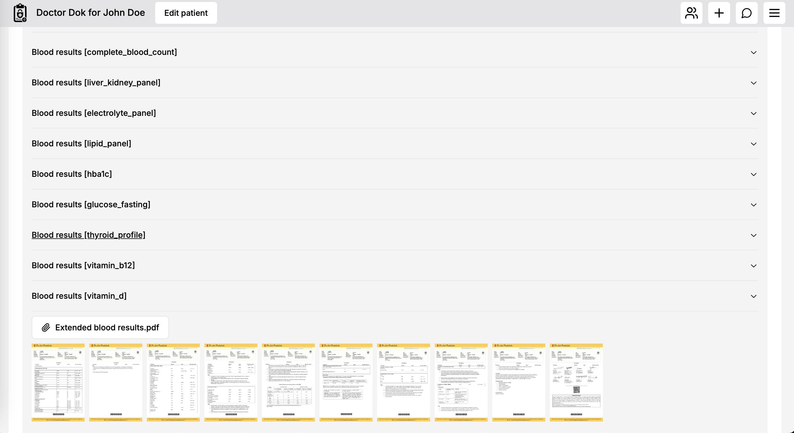
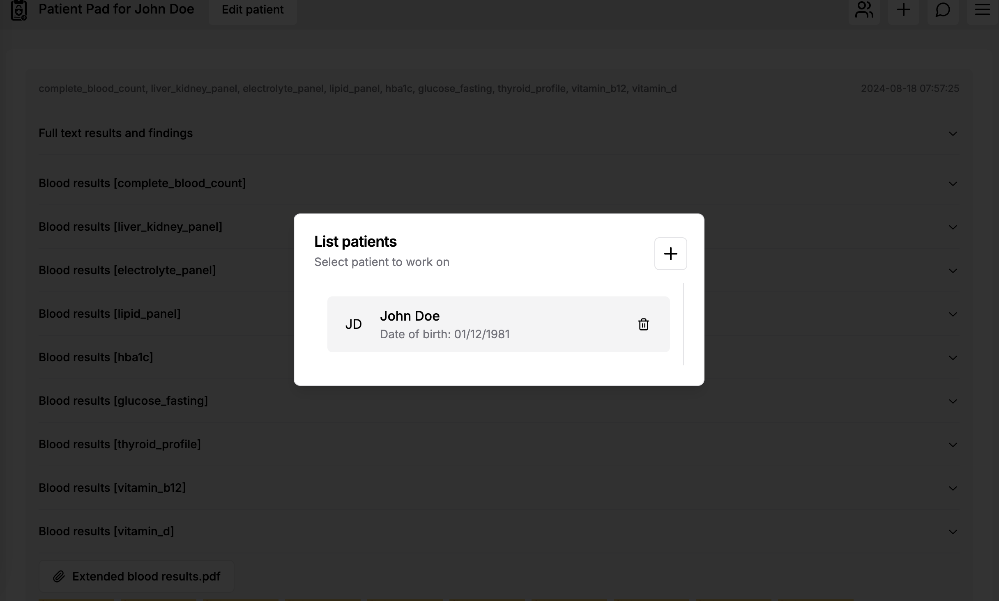
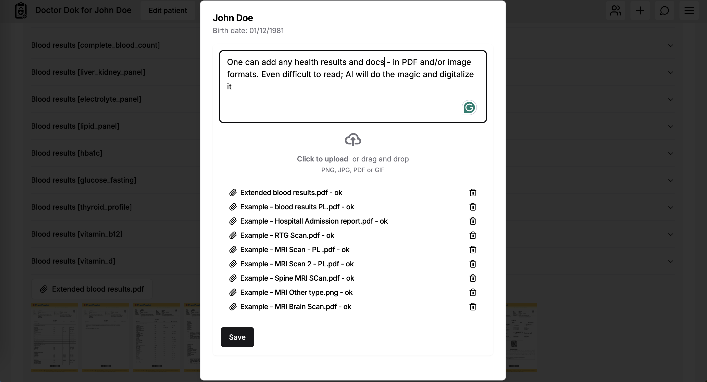
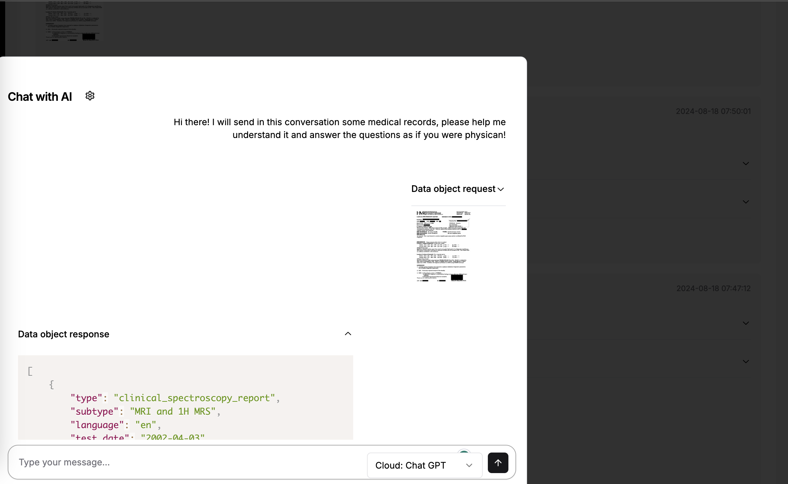
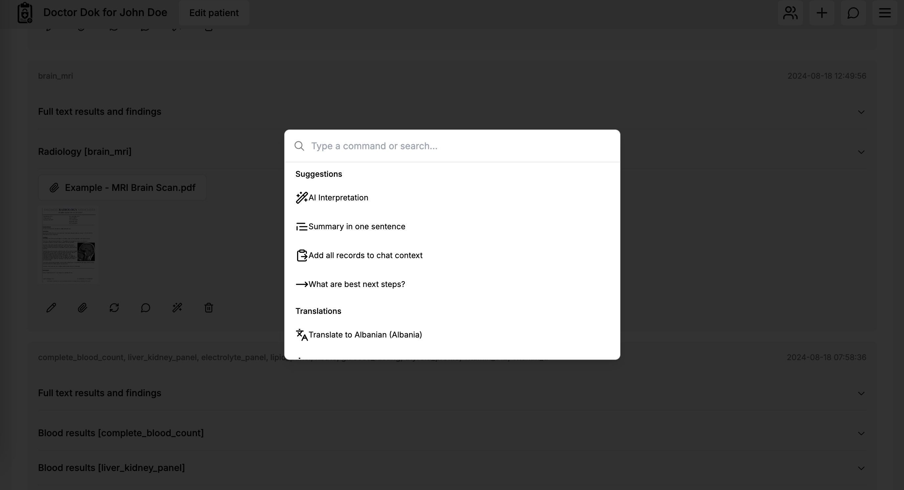
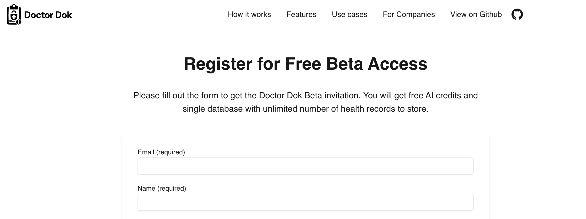
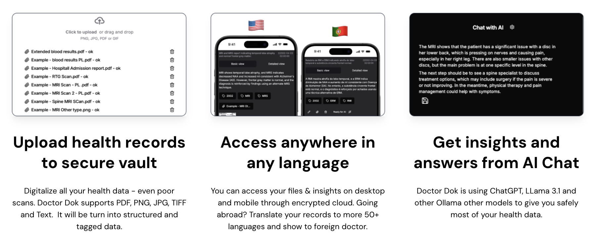

## Doctor Dok

<p align="center">
    
</p>

**1 Password + AI for Health**

**Convert all your Blood Tests, MRI Scans, TK Scans, After Visit reports, Hospital Admission Reports to JSON, safely store in the cloud and discuss, annotate, translate it with AI.**

Doctor Dok is a secure storage, digitization, sharing and AI discovery platform for all your family and/or folders health data.

All health history - digitalized - accesible anywhere from Mobile or Desktop. Using AI you may **translate your health records to one of 50+ languages** - making abroad health services more accesible.

Doctor Dok uses AI to OCR even a hardly readable photo of your healt documents. Then stores it in cloud with [Zero Trust Security architecture](https://github.com/CatchTheTornado/doctor-dok/issues/65) (no body but You can decrypt the data). 

Chat GPT, LLama 3.1 and other Ollama supported AI models avaialble.

<table>
    <tr>
        <td>
            <a href="readme-assets/screen0.png"></a>
        </td>
        <td>
            <a href="readme-assets/screen1.png"></a>
        </td>
        <td>
            <a href="readme-assets/screen2.png"></a>
        </td>
    </tr>
    <tr>
        <td>
            <a href="readme-assets/screen3.png"></a>
        </td>
        <td>
            <a href="readme-assets/screen4.png"></a>
        </td>
        <td>
            <a href="readme-assets/screen5.png"></a>
        </td>
    </tr>
</table>


**Using AI Chat one might analyze years of medical history within seconds** self-formulating second opinions, checking possible treatments, checking medicine co-inferences etc.

## Try it out

You can host Doctor Dok on your own because it's <a href="LICENSE">MIT Licensed</a> Open Source. You might also want to give it a try in a hosted, fully secured, end2end encrypted environment by registering to beta tests on https://doctordok.com. You'll get AI tokens + free hosting for your health data.

<a href="https://doctordok.com"></a>


## Key Features:

- Digitalize all your health data - even poor scans, converts it to JSON structuralized data,
- Fully secured Data import and export (ZIP archives, created inside your Browser - end 2 end encryption)
- Interactive chat mode,
- Advanced filtering,
- Data timelining according to record contents (real examination dates etc)
- Support for advanced data processing - like conversion from/to FHIR,
- Chat with AI with selected or All your health records in the context,
- Translate your records to more 50+ languages,
- Chat GPT, LLama 3.1 and other Ollama supported AI models support,
- Tesseract OCR as an alternative OCR supported,
- PDF, PNG, JPG, TIFF, Text support,
- Standarized JSON data format storage,
- Multi page attachments support,
- Supports All types of medical records: Blood results, MRI Scans, RTG Scans, After-Visit reports ...
- Multi Folders support,
- PII (Personaly Identifiable Information) removal using AI or Blacklisting,
- End 2 End data encryption - [read about the architecture](https://github.com/CatchTheTornado/doctor-dok/issues/65)
- Safe sharing within your family, with your physician etc - using Sharing Key feature,
- Access from Mobile or Desktop,
- Dark and Light themes supported,
- Full Rest API with JWT authorization for managing `folders`, `patinet-records`, `encrypted-attachments`, ai integrations and so on.
- 100% TypeScript, Next JS, React + Shadcn-ui tech stack.



## Software use cases
- **End user** - using Doctor Dok as health AI cloud,
- **Med provider** - using Doctor Dok as secure framework - an EHR with per-patient secure folder sharing,
- **Med tech** - using Doctor Dok as a framework for product development, AI experiments etc.

## Structured data

Doctor Dok uses standarized JSON format to which parses all input health records. By doing so it opens a way for all exciting new features like data summarization, diagraming, data compression, taking even years long health history into AI context. Things that previously were very difficult or even impossible for human beings.

## Encrypted storage

All the health records (including file attachments) are **encrypted in the browser** before sending to the server. Your private key is never exchanged with the server. Therefore there's no way to access, take over or modify the data. The only exception is if you decide to use Chat GPT which is powering data-parsing, summary, context and conclusion making processes. Even if so, you're up to enter your own Chat GPT API key and the data is being sent directly from your browser to chatGPT subject to [OpenAI privacy policies](https://openai.com/pl-PL/policies/eu-privacy-policy/).

## Getting Started

Virtually no external dependencies. This app uses SQLite to store per-user database of folders and health records. To start the app just run:

```bash
yarn dev
```

Open [http://localhost:3000](http://localhost:3000) with your browser to see the result.

To use AI features make sure you set your chat GPT API Key in the settings.

Available ENV settings (overrides the UI settings):

```js
export const ENV_PROVIDED_CONFIG = {
  chatGptApiKey: process.env.NEXT_PUBLIC_CHAT_GPT_API_KEY,
  displayAttachmentPreviews: process.env.NEXT_PUBLIC_DISPLAY_ATTACHMENT_PREVIEWS,
  ocrProvider: process.env.NEXT_PUBLIC_OCR_PROVIDER,
  ocrLanguage: process.env.NEXT_PUBLIC_OCR_LANGUAGE,
  ollamaUrl: process.env.NEXT_PUBLIC_OLLAMA_URL,
  ollamaModel: process.env.NEXT_PUBLIC_OLLAMA_MODEL,
  llmProviderChat: process.env.NEXT_PUBLIC_LLM_PROVIDER_CHAT,
  llmProviderParse: process.env.NEXT_PUBLIC_LLM_PROVIDER_PARSE,
  llmProviderRemovePII: process.env.NEXT_PUBLIC_LLM_PROVIDER_REMOVE_PII,
  piiGeneralData: process.env.NEXT_PUBLIC_PII_GENERAL_DATA
}
```

## Medical use cases

### Medical Records
Extract key patient data points for comprehensive health timelines. Identify potential gaps in care or follow-up needs.

### Clinical Findings
Capture and categorize clinician observations. Correlate subjective findings with objective data points.

### Hematology Report
Standardize diverse hematology reporting formats. Flag unusual cell populations or counts for specialist review.

### Pathology Report
Extract key findings from narrative reports. Organize biopsy results for easy review and comparison.

### Serology Results
Standardize antibody test results across different assays. Monitor immune status changes over time.

### Electrolyte Panel
Track electrolyte balance over multiple tests. Alert to rapid changes or consistent imbalances.

### Renal Function Tests
Calculate and track kidney function metrics over time. Highlight trends that may indicate declining renal function

### Radiology Report
Extract key findings from narrative radiology reports. Link report data with actual images for comprehensive review.

### Microbiology Results
Organize culture results and antibiotic sensitivities. Track pathogen prevalence and antibiotic resistance patterns.

### Blood Test Results
Convert unstructured lab reports into structured data. Flag abnormal values and suggest relevant follow-up tests

### Biomarker Levels
Track biomarker fluctuations across time. Alert to significant changes that may indicate need for intervention.

### Immunology Results
Quantify immune response markers. Track immunological changes in response to treatments or interventions.

### Patient History
Compile chronological health events from various documents. Identify potential risk factors based on historical data.

### CBC (Complete Blood Count)
Normalize CBC data across different lab formats. Visualize trends in blood cell populations over time.

### Liver Function Tests (LFTs)
Monitor liver enzyme trends. Flag patterns indicative of potential liver stress or damage.

### Metabolic Panel
Integrate various metabolic markers for a holistic view. Suggest lifestyle or dietary changes based on metabolic trends.

### Urinalysis
Standardize urinalysis results from different lab formats. Track changes in urine composition over time.

### Genetic Testing
Structure complex genetic data into interpretable formats. Identify potential genetic factors relevant to current health status.


## License

Doctor Dok is released under [MIT](LICENSE) license.
